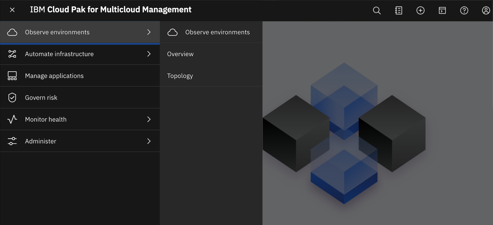

---

copyright:
  years: 2019
lastupdated: "2019-12-13"

---

{:new_window: target="_blank"}
{:shortdesc: .shortdesc}
{:screen: .screen}
{:codeblock: .codeblock}
{:pre: .pre}
{:child: .link .ulchildlink}
{:childlinks: .ullinks}

# What's new in {{site.data.keyword.cloud_pak_mcm}} version {{site.data.keyword.version_cp}}

Get a quick overview of what is added, changed, improved, or deprecated in this release.
{:shortdesc}

{{site.data.keyword.cloud_pak_mcm}} version {{site.data.keyword.version_cp}} introduces the following new features and enhancements

  * [Module versions](#modules)
  * [Installation, configuration, and upgrade](#install)
  * [Administering](#admin)
  * [Security and compliance](#security)
  * [Cluster management](#cluster_mngmt)
  * [Application management](#app_mngmt)
  * [Performance improvements](#cluster)
  * [{{site.data.keyword.gui_caps_only}}](#gui)
  * [Technology preview](#preview)

## Module versions

The {{site.data.keyword.cloud_pak_mcm}} includes the following modules:

| Module | Version |
|--|--|--|
|{{site.data.keyword.IBM_notm}} Cloud App Management that includes {{site.data.keyword.IBM_notm}} Cloud Event Management  | 2019.4.0 |
|{{site.data.keyword.IBM_notm}} Cloud Automation Manager | 4.1.0.0|

For what is new and changed for each module, see the following release notes:

  - [IBM Cloud App Management](https://www.ibm.com/support/knowledgecenter/SS8G7U_19.4.0/com.ibm.app.mgmt.doc/content/overview_whatsnew.html?cp=SSFC4F_1.2.0)
  - [IBM Cloud Automation Manager](https://www.ibm.com/support/knowledgecenter/SS2L37_4.1.0.0/cam_whatisnew.html?cp=SSFC4F_1.2.0)

## Installation, upgrade, and configuration
{: #install}

### Supported {{site.data.keyword.ocp_tm}} version

The {{site.data.keyword.cloud_pak_mcm}} supports
{{site.data.keyword.ocp_tm}} 4.2 for {{site.data.keyword.linux_bit}} with continued support for {{site.data.keyword.ocp}} 3.11 for {{site.data.keyword.linux_bit_notm}} and {{site.data.keyword.ppc}}.

### Installation and upgrade

You can perform an offline and online installation of the {{site.data.keyword.cloud_pak_mcm}}. Upgrade is supported for offline installations only.

  -  [Offline installation](../install/offline.md)
  -  [Online installation](../install/online.md)

### {{site.data.keyword.rh_tm}} configuration

Red Hat CloudForm functions are introduced in this version of the {{site.data.keyword.cloud_pak_mcm}}, and integration with the Ansible Automation Platform.

* You can now configure Red Hat Ansible Tower with {{site.data.keyword.IBM_notm}} single sign-on. For more information see, [Using {{site.data.keyword.rh_tm}} Ansible Tower](../install/ansible_tower.md). 

* You can now configure Red Hat CloudForms with {{site.data.keyword.IBM_notm}} single sign-on. For more information see, [Using {{site.data.keyword.rh_tm}} CloudForms](../install/cloudforms.md).

## Administering
{: #admin}

You can now add additional Prometheus instances to manage cluster monitoring. For more information, see [Adding additional Prometheus instances](../admin/add_prom_mcm.md).

## Security and compliance
{: #security}

### Governance and risk

You can now disable your policies. For more information, see _Disabling your security policy from the {{site.data.keyword.gui}}_ on the [Managing a security policy page](../mcm/manage_cluster/manage_grc_policy.md).

You can create and view vulnerability and mutation policy violations for your applications from the {{site.data.keyword.product}} Governance and risk dashboard. For more information, see the _Viewing application violations from the {{site.data.keyword.gui-short}}_ section of the [Managing a security policy page](../mcm/manage_cluster/manage_grc_policy.md).

You can create and update policies on your {{site.data.keyword.product}} hub cluster for multiple namespaces. You can view only the policies, violations, and security findings associated with your cluster and namespace. Update your PlacementPolicy to create policies on multiple namespaces. For more information, see [{{site.data.keyword.product}} policy example](../mcm/compliance/policy_example.md).

### Authentication with Red Hat {{site.data.keyword.open_s}}

You can enable authentication with Red Hat {{site.data.keyword.open_s}} when you install your cluster on a public cloud. For more information, see [Preparing to install the {{site.data.keyword.cloud_pak_mcm}}](../install/prep.md#auth).

## Cluster management
{: #cluster_mngmt}

### Amazon Elastic Kubernetes Service

In addition to the previously released cloud provider support, the product now supports creating an Amazon Elastic Kubernetes Service cluster with {{site.data.keyword.mcm_notm}}, which uses the Cluster API, a Kubernetes core-based API that is used to create, configure, and manage clusters with CRD and controller requirements. See [Amazon Elastic Kubernetes Service ](https://aws.amazon.com/eks/){:new_window} for more information about the public Kubernetes service.

### Stand-alone multicluster plug-in

The {{site.data.keyword.cloud_pak_mcm}} `mc` command is installed as a separate plug-in so that you can use the standard multicluster commands after you install the basic {{site.data.keyword.cloud_pak}} CLI (cloudctl). For example, with `cloudctl` capability, you can install the `mc` plug-in to import managed clusters. For more information, see [Installing the {{site.data.keyword.cloud_pak}} CLI (cloudctl) multicluster plug-in (mc)](../cli/installing_mc_plugin.md).

### Upgrading the `multicluster endpoint`

Upgrading the `multicluster endpoint` is easier with the simpler command: `cloudctl mc cluster upgrade <cluster-name>`. See [Upgrading multicluster endpoint](../mcm/manage_cluster/upgrade_mc_endpoint.md) for more details.

## Application management
{: #app_mngmt}

The application lifecycle management capabilities are enhanced to provide you with the following new or changed features:
- Create and edit application placement rules from the {{site.data.keyword.gui}} applications dashboard.
- {{site.data.keyword.gui_caps_only}} processes and views are simplified to provide you with a clearer view of your applications and resources and to make identifying and troubleshooting issues easier.
- Create subscriptions for GitHub channel repositories to store Kubernetes resource YAML files and unpackaged Helm charts.
- Schedule subscriptions to be active for only specific time ranges to control when deployments and upgrades to your managed cluster can begin.
- Store and deploy Kubernetes secrets through subscriptions.
For more information, see [Managing applications](../mcm/applications/overview.md).

The core application lifecycle resource templates are also now available as open source software through GitHub repositories. You can use these templates to help you learn about the application lifecycle resource types and migrate your existing applications to use the application lifecycle resource types. For more information, see:
- [multicloud-operators-subscription ](https://github.com/IBM/multicloud-operators-subscription)
- [multicloud-operators-deployable ](https://github.com/IBM/multicloud-operators-deployable)

## Performance improvements
{: #cluster}

When you select a {{site.data.keyword.product}} policy template specification while creating a policy from the {{site.data.keyword.gui}}, details for the following parameters might be prepopulated: Standards, Categories, and Controls. For more information about creating policies, see [Creating an {{site.data.keyword.product}} security policy](../mcm/compliance/create_policy.md).

You can now modify the `id-mycluster-account` value for the SA API. For more information, see [Security Advisor API](../mcm/manage_cluster/security_advisor.md).

## {{site.data.keyword.gui_caps_only}}
{: #gui}

### Navigation

The {{site.data.keyword.cloud_pak_mcm}} {{site.data.keyword.gui}} navigation has a new design that highlights product capabilities, while providing users clear pathways based on tasks and use-cases. Previous pages are mapped into the new primary categories. See the following list of navigation details:

  * Observe environments: View the _Overview_ and the _Topology_ page.
  * Automate infrastructure: Access your clusters and use {{site.data.keyword.rhel}} automation technology.
  * Manage applications: Define, deploy, manage applications and view application and deployment details.
  * Govern risk: Create policies to govern the system and see policy and violation details.
  * Monitor health: Provide rich performance data such as Incidents, App monitoring, Grafana, and Helm releases.
  * Administer: Access IAM and Metering capabilities.

### Header

From the {{site.data.keyword.cloud_pak_mcm}} header, you can now click (+) to create a resource. Additionally, you can now access the Search box from the header.

The following image displays navigation and header:

## Technology preview
{: #preview}

The following technology previews are new for this version:

  - Importing an Alibaba Cloud cluster
  <!-- (add once in KC) - Installing the {{site.data.keyword.cloud_pak_mcm}} through channels and subscriptions -->

For all of the features that are available in {{site.data.keyword.mcm_notm}} as technology preview code (TPC) only, see the [Technology preview](../mcm/tech_previews/tech_overview_mcm.md) section.

